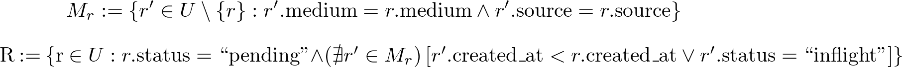

# Karuna Coding Challenge

This challenge consists of many questions, each designed to test a different skillset which we consider crucial to being part of our early-stage team. Each question should take at most an hour (with the exception of the React questions, see below). This is not meant to be a whiteboard exercise or something to test your memorization skills. We want to see how you problem-solve as an engineer. Feel free to use your standard environment, tools, resources, etc. You can Google anything you'd like, use public libraries, and do all thing things you'd normally do. We only request that your submission be self-contained (use standard mechanisms such as a `package.json` or `Gemfile` to pull in external dependencies if needed), and that you don't get anyone else to help you (no asking friends for tips and write all your own code).

Please select 3 of the below challenges, and complete them. If you are applying for a frontend position, at least one of these *must* be a React question (_Messaging Client (Frontend)_ or _`Brainfuck` Execution Visualizer_).

The React questions can take slightly longer than the others, so we recommend doing them first, and keeping track of your time. If one of these ends up taking more than 90 minutes, we will count it as two questions (without penalty - we are more concerned with your quality than your speed), so you only have to submit one other.

Additionally, we will ask you to submit a code sample. This should be the piece of code that you are most proud of. You could be proud of this code because of how elegant, efficient, or otherwise beautiful it is.

## Respecting Your Time

We understand that asking you to take time out of your busy personal schedule to do our coding challenge is significant—we value your time! We've been on the other end of enough of these to know how it feels when your time is taken for granted, so we do a few things to mitigate that feeling.

1. A hard time limit: unless you _want_ to, please do not spend more than 3.5 hours on this challenge. Let us know if you hit this limit—it probably means we messed up.
2. Please give us feedback on how long each question takes you, and if any feel too short or too long.
3. This coding challenge is a part of our on-site. We're not taking time away from you in addition to a full day in our office. Instead, we understand that most people would prefer to write code on their own time, in their own environment, rather than on a whiteboard in our office. Therefore, we give you the bulk of the technical interview in the form of this challenge, and simply spend time in the office going over your solutions. For some roles, we might ask you to do one more hour of work during your onsite. If you'd prefer to come sit in our office and do this challenge right before your onsite, let us know and we can make that happen!
4. If you feel strongly that you must be compensated for your time spent on this, we understand. Please let us know, and we will gladly compensate you a fair (but startup-appropriate) amount.

## Environment

Some questions must be completed in Ruby (since this is the language the majority of our backend systems are currently written in). If you're unfamiliar with Ruby, check out this [migration guide](https://www.ruby-lang.org/en/documentation/ruby-from-other-languages/). Hopefully you don't feel too hindered by this restriction - feel free to include a note if you found it particularly annoying, or to let us know that you're strongest with another language.

The SQL question is run against an up-to-date Postgres instance.

The React questions can use any sane build setup you wish (including a simple static HTML file). We recommend using a standard framework like [create-react-app](https://github.com/facebook/create-react-app) or [neutrino](https://neutrinojs.org/) (we like this one!). We will run your code in a modern version of Chrome, unless you tell us to do something else.

## Submission

Please use the following procedure to submit your response to this challenge. While the repository is shared, your submission will be encrypted, and your commit will be anonymous.

1. Clone this repo
2. Run [`scripts/new_submission.sh`](scripts/new_submission.sh) to generate a directory for your submission
3. `cd` into the working directory for your submission
4. Place your challenge submissions for each question in the relevant sub-directory
5. Add your code sample
6. Run [`scripts/finalize_submission.sh`](scripts/finalize_submission.sh) to encrypt your submission, commit it, and push it to a new branch
7. Email us and let us know you have submitted!

If you need up update your submission, please use [`amend_submission.sh`](scripts/amend_submission.sh).

## API

Some questions will depend on an endpoint served by our coding challenge API. You can access this API at `https://sec.meetkaruna.com/api/v1`. Each request will require a `user_id` query parameter, for which you should use your GitHub username.

Most endpoints can be paginated using the `page` and `per_page` query params, which default to `0` and `10` respectively.

## Improvements

This coding challenge is very much in beta! Feel free to email us with improvements, or, better yet, submit pull requests with fixes and enhancements!

## Questions

### Rate Limiting

Design a class that allows for rate-limiting of arbitrary code blocks. Initially, assume there is only one thread using an instance of the class at a time, and that any state can be stored internally and locally. You are free to choose any sane rate-limiting algorithm. Please include a test file (or modify the [existing one](template/rate_limiting/test_rate_limiter.rb)) to demonstrate the correctness of your class. Do not worry about writing particularly performant code; the focus should be on correctness and code quality.

If you have time, feel free to add creative extensions, such as thread-safety, per-instance default options, shared remote state in a database, alternative rate-limiting schemes, or improving runtime/memory performance. This is strictly optional.

The class should be called `RateLimiter`, and it should have a single public method, `limit`. The initializer should accept a hash of options that includes `throws`. The `limit` method should take a `name`, `threshold`, and `period`. This is demonstrated below.

If `throws` is `true`, the block should raise a `RateLimiter::Limited` error when the number of calls exceeds the `threshold` for a given `period`. If `throws` is `false`, the block should simply not execute, instead of throwing an error.

You may assume that there is a maximum to the length of any `period` of `10.minutes`. Please document this or any other assumptions clearly.

```ruby
class RateLimitTester
  def initialize
    @limiter = RateLimiter.new(throws: true)
  end

  def expensive_foo!
    @limiter.limit(:expensive_foo, threshold: 3, period: 1.minute) do
      sleep 1
    end
  end
end

tester = RateLimitTester.new
3.times { tester.expensive_foo! }
tester.expensive_foo! # should raise RateLimiter::Limited
```

### SQL

We are attempting to build a service which receives messages to be sent, and queues them locally so that they can be delivered to the recipient one at a time. Messages have a `medium` (such as "SMS") and an `identifier` (such as "+12345678900"), which together uniquely identify a recipient. The external service we use to send messages alerts us when a message has been delivered, so that the next message for a recipient (if any) can be sent out.

We wish to write a query that gives us the messages which are eligible to be sent at the given moment. It should preserve the ordering of messages, and ensure a message is only sent after the previous message for a recipient is delivered. This means we want to return, per recipient, the _earliest_ pending message, assuming there are no messages currently in-flight for that recipient. If there are any messages in-flight for that recipient, we want to return nothing.

Assume you have a table created with the following schema.

```sql
CREATE TABLE messages (
  id integer PRIMARY KEY,
  medium character varying NOT NULL,
  identifier character varying NOT NULL,
  status integer NOT NULL,
  body text NOT NULL,
  created_at timestamp without time zone NOT NULL
);
```

`status` is an enum, with the following value map.

```ruby
{
  0: :pending,
  1: :inflight,
  2: :succeeded,
}
```

Write a single query ([CTE](https://www.postgresql.org/docs/9.1/static/queries-with.html)s are allowed) which returns all rows `r` that satisfy the following:

- `r.status` is `pending`
- there are no rows with the same `(medium, identifier)` as `r` that are also `pending` but have an earlier `created_at` (this ensures the returned row is the earliest pending message for the recipient)
- there are no rows with the same `(medium, identifier)` as `r` that are `inflight`

If it helps, the formal definition of the set `R` of returned rows are as follows. Here, `U` is the set of all records in the database, and `M_r` is the set of records that have the same `medium` and `identifier` as a record `r`.




```tex
M_r := \{r' \in U \setminus \{r\} : r'.\text{medium} = r.\text{medium} \land r'.\text{source} = r.\text{source}\}

R := \{r \in U : r.\text{status} = \text{``pending''} \land (\nexists r' \in M_r)\left[r'.\text{created\_at} < r.\text{created\_at} \lor r'.\text{status} = \text{``inflight''}\right]\}
```

### Messaging Client (Frontend)

We wish to build a client for the platform described in the [messaging architecture](docs/messaging_architecture.md) spec.

Build a functional, standalone React app that displays a set of conversations, each with a series of messages between two parties. Assume the person viewing the app is one of the participants in each conversation (don't worry about supporting multiple users). The basic requirements are: 

- Be able to view the list of conversations with others
   - Conversations are displayed in descending order of their last timestamp 
   - Display a preview of each conversation (name, unread count, and last message time)
   - Search for a given conversation by the other person's name 
- View the messages of a selected conversation in-order
   - Incoming vs outgoing messages must be visually distinct
   - Compose a new message (plain text is sufficient) and "send" a new message (storing the message in-memory and having it appear in the interface)
- If I am viewing a conversation and refresh the page, then I should still be viewing that conversation when the page reloads
  - Persisting new outgoing messages is optional

While you are free to store outgoing messages in-memory, please use the below API endpoints to fetch the set of existing conversations and messages.

If you have time, feel free to add creative extensions, such as fuzzy searching (of conversation names or message contents), persisting new outoging messages, rich-text composing, handling new realtime incoming messages, or anything else you can think of! 

Remember to focus on code quality. If you don't have time to implement everything exactly as you want to, leave comments letting us know how you would have done it better!

#### `GET /conversations`

This endpoint returns a list of conversations, which include the name of the other party, and an ID. You can use this ID to fetch the messages of a given conversation, as below.

```json
{
  "page": 0,
  "total": 1,
  "data": {
    "conversations": [
      {
        "uuid": "1FCA5132-535C-489E-B1C8-6ABDD34FFF8A",
        "name": "Yasyf Mohamedali",
        "unread": 1,
        "last_message": {
          "uuid": "89A76DA9-930D-4C31-9997-3878364F7559",
          "body": "Hello, World!",
          "direction": "incoming",
          "created_at": "2018-08-20T22:33:28.660Z"
        }
      }
    ]
  }
}
```

#### `GET /conversations/<uuid>`

This endpoint lists the messages of a given conversation. Each message has a timestamp, an ID, a body, and a direction (`outgoing|incoming`).

```json
{
  "page": 0,
  "total": 1,
  "data": {
    "messages": [
      {
        "uuid": "89A76DA9-930D-4C31-9997-3878364F7559",
        "body": "Hello, World!",
        "direction": "incoming",
        "created_at": "2018-08-20T22:33:28.660Z"
      }
    ]
  }
}
```

### Messaging Client (Design)

We wish to design the frontend described above.

Please design mockups that demonstrate how someone might build the coordinator-facing interfaces for our messaging product. The same basic requirements from the previous section apply.

If you have time, feel free to add creative extensions, such as addressing how to intuitively allow the coordinator to express intent ("I want to remind the patient to take their medication") or delivery restrictions ("only deliver this message during daylight hours").


### Creative Web

This one is fun! Please include all the solutions you can possibly imagine to the following, in a Markdown file called `solutions.md`.

> What is the most creative way you can get a circle to appear on the screen of a web browser?

Additionally, please implement your favourite solution. Include a run script (`run.sh`) which we can run to test your solution. This script should do any necessary building and compilation, and print either an address or a file we can open in a web browser running on the same machine.

### `Brainfuck` Interpreter

> [`Brainfuck`](https://en.wikipedia.org/wiki/Brainfuck) is an esoteric programming language created in 1993 by Urban Müller, and notable for its extreme minimalism.

> The language consists of only eight simple commands and an instruction pointer. While it is fully Turing complete, it is not intended for practical use, but to challenge and amuse programmers. Brainfuck simply requires one to break commands into microscopic steps.

Implement a `Brainfuck` interpreter (as a Ruby class), which takes in a script and executes it. We will include a single test script to help you test correctness, but encourage you to write more tests.

The official [Brainfuck language spec](https://www.muppetlabs.com/~breadbox/bf/) and [Wikipedia article](https://en.wikipedia.org/wiki/Brainfuck) will be helpful.

If you have time, feel free to add creative extensions, such as garbage-collection, or the ability to inspect, debug and step through the execution environment.

The class should be called `Brainfuck`, and it should have a single public method, `interpret!`. The initializer should accept two keyword arguments: `input:` and `output:`, both of type [`IO`](https://ruby-doc.org/core-2.3.1/IO.html). `interpret!` should simply take a `String` containing the instructions of the program to execute.

```ruby
class BrainfuckTester
  def initialize
    @interpreter = Brainfuck.new(input: $stdin, output: $stdout)
  end

  def test!
    script = "++++++++[>++++[>++>+++>+++>+<<<<-]>+>+>->>+[<]<-]>>.>---.+++++++..+++.>>.<-.<.+++.------.--------.>>+.>++."
    @interpreter.interpret!(script) # prints "Hello World!\n"
  end
end
```

### `Brainfuck` Execution Visualizer

See the previous question for an overview of `Brainfuck`. You do not need any background context on compilers or the `Brainfuck` language to complete this challenge.

We want to build an _execution visualizer_, which is a web app that executes a program step by step, and can show at any given time where we are in the program's execution (which line is being run currently), and what our memory currently looks like. An example of an execution visualizer can be found [here](https://goo.gl/nDth8B). We recommend you play with this example for a bit to get familiar with what we are trying to build.

We will provide an API implementing a `Brainfuck` interpreter that will execute a program one step at a time, and return after each step a dump of the current memory.

Build a functional, standalone React app that takes in a Brainfuck script (e.g. in a text field), shows the parsed script being executed, intelligently displays the parts of the data array which are not empty (including the string representations of the cell contents, if possible), and indicates where the instruction and data pointers are. There should be a visual indication (animations, colours, etc.) when any of these change.

This assignment is intentionally open-ended; build whatever you think is appropriate to help someone understand the execution of a Brainfuck script.

To help with this assignment, we provide an API which parses and executes a given script. Initially, you might want to avoid scripts that require input. If you have time, you can add support for providing input via the endpoint below.

#### `POST /brainfuck`

This endpoint takes one mandatory parameter, `script`, which is a string containing the Brainfuck script to be executed. It also takes an optional `input` parameter, which is used to buffer some input characters before execution begins.

The response is a representation of the state of a Brainfuck execution environment. This state contains an ID which you need to step through the execution of the script. It also contains an array representing the parsed script, and another showing the data array (this will be quite long).

```json
{
  "id": "3fd24c3b-973d-47d6-8e47-b90f7e9a4bb3",
  "done": false,
  "instruction_pointer": 0,
  "data_pointer": 0,
  "input": "",
  "output": "",
  "script": [
    "+",
    "+"
  ],
  "data": [
    0,
    0
  ]
}
```

#### `POST /brainfuck/<id>/step`

This endpoint takes an optional `input` parameter: a string to be concatenated to the input buffer.

This endpoint also takes an optional `count` parameter: the number of steps to take (defaults to 1).

After processing any additional input, this endpoint steps the Brainfuck interpreter forward by one instruction, and returns the state. Any output thus far can be found in the state, as well as the current values for the instruction and data pointers.


### Code Sample

Please include with it a brief description of what your code does, and why you're so proud of it.


